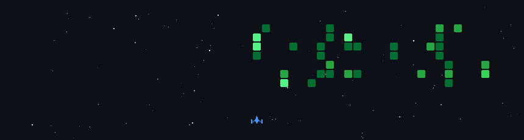

<h1 align="center">
  
</h1>

  

  

### About Me
- I’m currently working on a ** Software as a Service Project **
- I’m currently learning in the field of ** Cyber Security **
- How to reach me: turedi.ege07@gmail.com

---

### Tech Stack & Tools

  

---

### GitHub Stats

  
  

---

### Connect with Me

  
  
  

---

  

